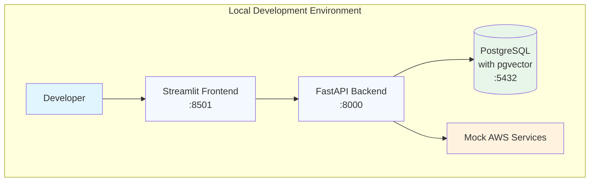

# Local Testing Solution Summary

I've created a comprehensive local testing solution for your AWS ECS RAG application. Here's what's been provided and how to use it.

## Overview

The solution includes two approaches for local testing:

1. **Complete Local Testing** - Uses mock AWS services with LocalStack (fully offline)
2. **Hybrid Testing** - Uses real AWS Bedrock with local PostgreSQL

## Files Created

1. **LOCAL_DEVELOPMENT_GUIDE.md** - Comprehensive guide with complete LocalStack setup
2. **QUICK_LOCAL_TESTING.md** - Simplified guide for quick testing with mocks
3. **LOCAL_TESTING_CHECKLIST.md** - Detailed verification checklist

## Recommended Approach

For most development scenarios, I recommend the **Quick Local Testing** approach (from QUICK_LOCAL_TESTING.md) because:

- It's simpler to set up
- Doesn't require LocalStack configuration
- Provides deterministic mock responses
- Faster startup time
- Easier to troubleshoot

## Quick Start Instructions

### 1. Create docker-compose.yml

Create this file in your project root (provided in QUICK_LOCAL_TESTING.md):

```yaml
version: '3.8'

services:
  postgres:
    image: pgvector/pgvector:pg15
    environment:
      POSTGRES_DB: rag_db
      POSTGRES_USER: rag_user
      POSTGRES_PASSWORD: rag_password
    ports:
      - "5432:5432"
    volumes:
      - postgres_data:/var/lib/postgresql/data
    healthcheck:
      test: ["CMD-SHELL", "pg_isready -U rag_user -d rag_db"]
      interval: 5s
      timeout: 5s
      retries: 5

  backend:
    build: ./backend
    environment:
      - DB_HOST=postgres
      - DB_PORT=5432
      - DB_NAME=rag_db
      - DB_USERNAME=rag_user
      - DB_PASSWORD=rag_password
      - AWS_REGION=us-east-1
      - AWS_ACCESS_KEY_ID=test
      - AWS_SECRET_ACCESS_KEY=test
      - EMBEDDING_MODEL_ID=amazon.titan-embed-text-v1
      - LLM_MODEL_ID=meta.llama3-8b-instruct-v1:0
    ports:
      - "8000:8000"
    depends_on:
      postgres:
        condition: service_healthy
    volumes:
      - ./backend:/app
    command: uvicorn app.main:app --host 0.0.0.0 --port 8000 --reload

  frontend:
    build: ./frontend
    environment:
      - BACKEND_URL=http://backend:8000
    ports:
      - "8501:8501"
    depends_on:
      - backend
    volumes:
      - ./frontend:/app
    command: streamlit run app.py --server.port=8501 --server.address=0.0.0.0 --server.headless=true

volumes:
  postgres_data:
```

### 2. Update Backend Configuration

Update `backend/app/config.py` to use environment variables (provided in the guide).

### 3. Create Mock Services

Create the mock AWS services in `backend/app/mocks/aws_services.py` (provided in the guide).

### 4. Update RAG Classes

Update `backend/app/rag/embeddings.py` and `backend/app/rag/generator.py` to use mock services when in local environment (provided in the guide).

### 5. Start and Test

```bash
# Start services
docker-compose up -d

# Wait for services to be ready (about 30 seconds)
docker-compose ps

# Test the application
curl http://localhost:8000/health

# Access the frontend
open http://localhost:8501
```

## Key Features of the Solution

### Mock AWS Services
- **Deterministic Embeddings**: Same text always produces same embedding
- **Contextual Responses**: Mock responses based on query content
- **Sample Document Awareness**: Responses tailored to your sample documents
- **Error Simulation**: Can simulate AWS service failures

### Database Setup
- **pgvector Extension**: Automatically enabled for vector storage
- **Automatic Seeding**: Sample documents loaded on startup
- **Health Checks**: Ensures database is ready before starting backend
- **Persistent Storage**: Data preserved across container restarts

### Testing Features
- **Health Endpoints**: Verify service status
- **API Documentation**: Auto-generated OpenAPI docs
- **Query Testing**: Test RAG pipeline with sample questions
- **Statistics**: Monitor document indexing status

## Sample Test Queries

Once running, try these queries to test the system:

1. "What is machine learning?"
2. "Explain cloud computing"
3. "What is Kubernetes?"
4. "How does RAG work?"
5. "What are data security best practices?"

## Verification Checklist

Use the LOCAL_TESTING_CHECKLIST.md to verify:

- [ ] All services start correctly
- [ ] Database is seeded with sample documents
- [ ] Backend API responds correctly
- [ ] Frontend displays responses
- [ ] Vector search returns relevant results
- [ ] Error handling works properly

## Troubleshooting

Common issues and solutions are documented in both guides:

1. **PostgreSQL Connection Issues**
2. **Backend Startup Problems**
3. **Frontend Connection Issues**
4. **Mock Service Problems**

## Benefits of This Approach

1. **Fast Feedback Loop**: Test changes locally without AWS deployment
2. **Cost Effective**: No AWS charges during development
3. **Offline Development**: Work without internet connection
4. **Deterministic Testing**: Consistent results for testing
5. **Easy Debugging**: Full access to logs and containers
6. **Production-like Environment**: Similar to AWS ECS setup

## Next Steps

1. **Implement the Solution**: Follow the QUICK_LOCAL_TESTING.md guide
2. **Run the Checklist**: Use LOCAL_TESTING_CHECKLIST.md to verify
3. **Test Your Changes**: Make modifications and test locally
4. **Deploy with Confidence**: Once satisfied, deploy to AWS ECS

## Support

If you encounter issues:

1. Check the troubleshooting sections in the guides
2. Review container logs: `docker-compose logs [service-name]`
3. Verify all configuration files are correctly created
4. Ensure all prerequisites are installed

## Architecture Diagram



This local testing solution should give you confidence that your RAG application works correctly before deploying to AWS ECS. The mock services provide realistic behavior while keeping the setup simple and fast.