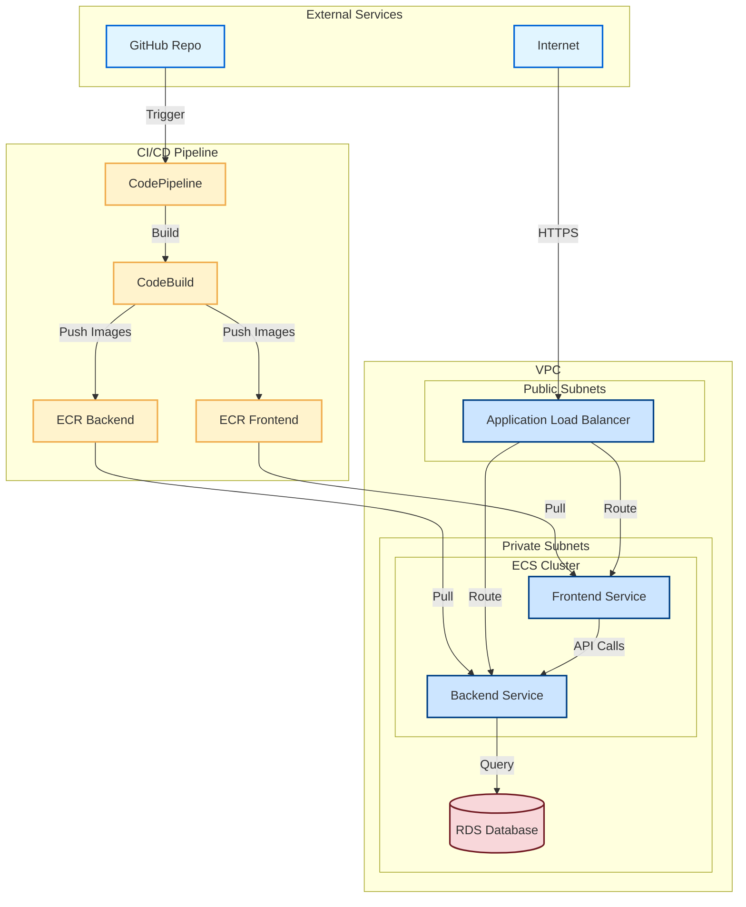

# AWS ECS RAG Test Project

A project to practice and learn how to implement a RAG (Retrieval-Augmented Generation) solution with ECS using best practices.

## Overview

This project demonstrates a complete ECS-based architecture for a RAG application, including:
- VPC networking
- ECS Fargate services for backend and frontend
- RDS database
- Application Load Balancer
- CodePipeline for CI/CD
- Monitoring and security best practices

## Quick Start

### Prerequisites

- Docker installed and running
- AWS CLI installed and configured
- Terraform installed
- Appropriate AWS permissions

### Automated Deployment (Recommended)

The project includes an automated solution for handling initial ECR images, which eliminates the need for manual intervention during deployment.

```bash
# Run the automated deployment script
./scripts/deploy-with-initial-images.sh
```

This script will:
1. Check all prerequisites
2. Create all infrastructure including ECR repositories
3. Automatically push placeholder images to ECR
4. Deploy ECS services with the placeholder images
5. Set up CodePipeline for future deployments

For detailed information about the automated ECR initialization approach, see [docs/automated-ecr-initialization.md](docs/automated-ecr-initialization.md).

### Manual Deployment

If you prefer to handle ECR images manually, see the [ecs-rag-checklist.md](ecs-rag-checklist.md) for step-by-step instructions.

## Architecture



## Project Structure

```
aws-ecs-rag-test-project/
├── backend/                    # Backend application code
├── frontend/                   # Frontend application code
├── terraform/                  # Infrastructure as code
│   ├── main.tf                # Main configuration
│   ├── variables.tf           # Input variables
│   ├── outputs.tf             # Output values
│   └── modules/               # Terraform modules
│       ├── vpc/              # VPC configuration
│       ├── ecs/              # ECS configuration
│       ├── rds/              # RDS configuration
│       ├── alb/              # Application Load Balancer
│       ├── codepipeline/     # CI/CD pipeline
│       ├── monitoring/       # CloudWatch monitoring
│       └── security/         # Security groups and IAM
├── scripts/                   # Utility scripts
│   └── deploy-with-initial-images.sh
├── docs/                      # Documentation
│   └── automated-ecr-initialization.md
└── iam-policies/             # IAM policies for different roles
```

## Documentation

- [Automated ECR Initialization](docs/automated-ecr-initialization.md) - Detailed explanation of the automated image handling approach
- [Project Checklist](ecs-rag-checklist.md) - Step-by-step deployment guide
- [Project Specification](ecs-rag-project-spec.MD) - Technical requirements and architecture
- [Prerequisites](PREREQUISITES.md) - Required tools and permissions

## Contributing

This is a learning project. Feel free to submit issues and enhancement requests.

## License

This project is for educational purposes.
