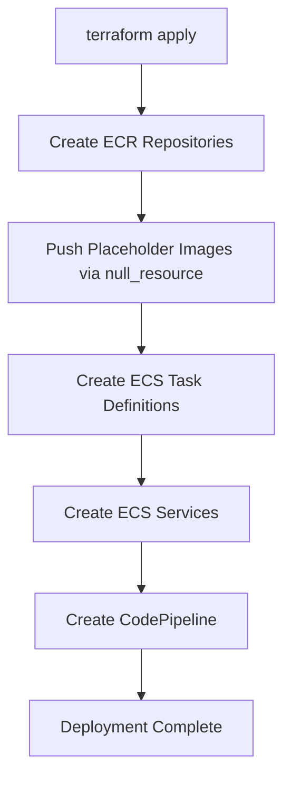

# Automated ECR Initialization for ECS RAG Project

This document describes the automated approach to handling initial ECR images for the ECS RAG project using Terraform's `null_resource` with `local-exec` provisioner.

## Overview

The challenge with ECS deployments is that task definitions reference ECR images, but those images must exist before the services can be created. This solution automates the process of pushing placeholder images to ECR repositories as part of the Terraform deployment.

## How It Works

### Terraform Implementation

1. **ECR Repository Creation**: Terraform creates the ECR repositories first
2. **Image Push Automation**: A `null_resource` with `local-exec` provisioner automatically:
   - Authenticates to ECR
   - Pulls a lightweight placeholder image (`hello-world`)
   - Tags it for both backend and frontend repositories
   - Pushes the images to ECR
3. **Dependency Chain**: ECS task definitions and services depend on the image push resource, ensuring images exist before services are created

### Key Components

#### In `terraform/modules/ecs/main.tf`:

```hcl
# Get AWS caller identity for ECR URL construction
data "aws_caller_identity" "current" {}

# Push placeholder images to ECR after repositories are created
resource "null_resource" "push_placeholder_images" {
  depends_on = [
    aws_ecr_repository.backend,
    aws_ecr_repository.frontend
  ]

  provisioner "local-exec" {
    command = <<-EOT
      # Authenticate to ECR
      aws ecr get-login-password --region ${var.aws_region} | docker login --username AWS --password-stdin ${data.aws_caller_identity.current.account_id}.dkr.ecr.${var.aws_region}.amazonaws.com
      
      # Pull a lightweight placeholder image
      docker pull public.ecr.aws/docker/library/hello-world:latest
      
      # Tag and push backend placeholder image
      docker tag public.ecr.aws/docker/library/hello-world:latest ${data.aws_caller_identity.current.account_id}.dkr.ecr.${var.aws_region}.amazonaws.com/${aws_ecr_repository.backend.name}:latest
      docker push ${data.aws_caller_identity.current.account_id}.dkr.ecr.${var.aws_region}.amazonaws.com/${aws_ecr_repository.backend.name}:latest
      
      # Tag and push frontend placeholder image
      docker tag public.ecr.aws/docker/library/hello-world:latest ${data.aws_caller_identity.current.account_id}.dkr.ecr.${var.aws_region}.amazonaws.com/${aws_ecr_repository.frontend.name}:latest
      docker push ${data.aws_caller_identity.current.account_id}.dkr.ecr.${var.aws_region}.amazonaws.com/${aws_ecr_repository.frontend.name}:latest
      
      echo "Placeholder images pushed successfully to ECR"
    EOT
  }

  # Trigger this resource whenever repositories are recreated
  triggers = {
    backend_repo_id  = aws_ecr_repository.backend.id
    frontend_repo_id = aws_ecr_repository.frontend.id
  }
}
```

#### Dependency Chain:

```hcl
# Task definitions depend on image push
resource "aws_ecs_task_definition" "backend" {
  # ... configuration
  depends_on = [null_resource.push_placeholder_images]
}

# Services depend on image push
resource "aws_ecs_service" "backend" {
  # ... configuration
  depends_on = [null_resource.push_placeholder_images]
}
```

## Usage

### Prerequisites

1. Docker installed and running
2. AWS CLI installed and configured
3. Terraform installed
4. Appropriate AWS permissions for:
   - ECR repository creation
   - ECR image push
   - ECS service creation

### Deployment Steps

#### Option 1: Using the Automated Script

```bash
# Run the deployment script
./scripts/deploy-with-initial-images.sh
```

This script:
- Checks all prerequisites
- Initializes Terraform
- Shows the execution plan for confirmation
- Runs the deployment with automated image pushing
- Provides next steps for updating to real application images

#### Option 2: Manual Terraform Deployment

```bash
cd terraform

# Initialize Terraform
terraform init

# Apply the configuration
terraform apply
```

## Benefits

1. **Single Command Deployment**: No manual steps required between infrastructure creation and service deployment
2. **Idempotent**: The process works correctly on initial deployment and re-deployments
3. **Automation Friendly**: Can be integrated into CI/CD pipelines
4. **No Manual Intervention**: Eliminates the need to manually comment/uncomment resources
5. **Dependency Management**: Terraform handles the correct order of operations

## Deployment Flow



## Post-Deployment

After the initial deployment with placeholder images:

1. **Build Real Application Images**:
   ```bash
   # Backend
   docker build -t backend ./backend
   # Frontend
   docker build -t frontend ./frontend
   ```

2. **Push Real Images**:
   ```bash
   # Get ECR repository URLs from Terraform outputs
   terraform output backend_ecr_repository_url
   terraform output frontend_ecr_repository_url
   
   # Tag and push real images
   docker tag backend:latest [BACKEND_ECR_URL]:latest
   docker tag frontend:latest [FRONTEND_ECR_URL]:latest
   docker push [BACKEND_ECR_URL]:latest
   docker push [FRONTEND_ECR_URL]:latest
   ```

3. **Update Services**: The real images will be deployed through CodePipeline or by updating the task definitions.

## Troubleshooting

### Docker Issues

- Ensure Docker is running: `docker info`
- Check Docker permissions: User should be in the docker group

### AWS Authentication

- Verify AWS credentials: `aws sts get-caller-identity`
- Check region configuration: `aws configure get region`

### Terraform Issues

- Ensure Terraform is initialized: `terraform init`
- Check state: `terraform show`

### ECR Issues

- Verify repository creation: `aws ecr describe-repositories`
- Check image existence: `aws ecr list-images --repository-name [REPO_NAME]`

## Comparison with Other Approaches

| Approach | Pros | Cons |
|----------|------|------|
| **Automated (this solution)** | Single command, no manual steps, CI/CD friendly | Requires Docker on deployment machine |
| **Manual commenting/uncommenting** | Simple to understand | Error-prone, requires manual intervention |
| **Two-stage Terraform** | Clear separation of concerns | Multiple deployments required |
| **Targeted applies** | Granular control | Complex command sequence |

This automated approach provides the best balance of automation, reliability, and ease of use for most deployment scenarios.